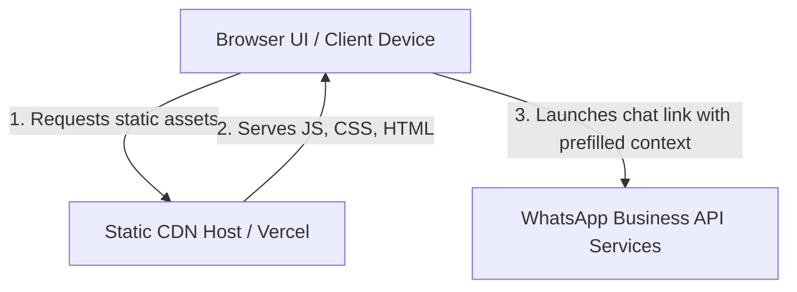
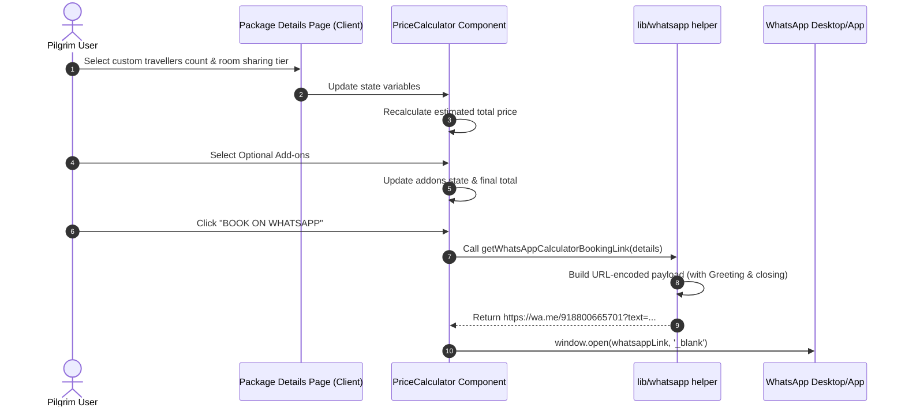
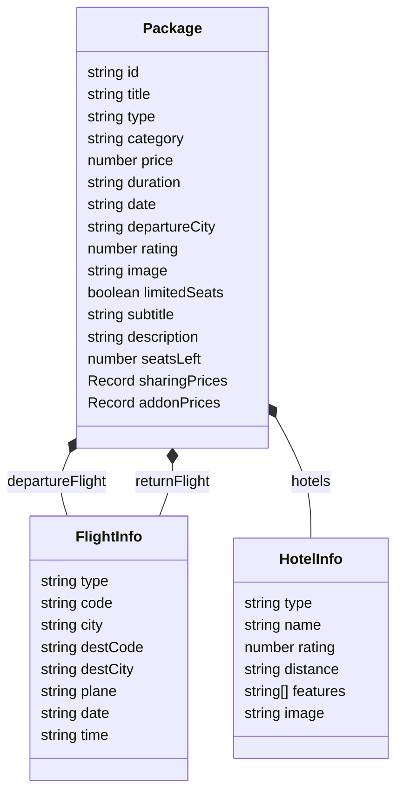

# Architecture Design - Aasia Travel

A detailed technical breakdown of the system architecture, component pipelines, and structural data relationships of the Aasia Travel application.

---

## Technical Architecture Summary

| Layer | Component Location | Tech Choice | Purpose |
| :--- | :--- | :--- | :--- |
| **Frontend/BFF** | `src/app/`, `src/components/` | Next.js 16.2.10 | Static-site generation, route skeleton loading, dynamic SEO headers |
| **Styling** | `src/app/globals.css` | Tailwind CSS v4 | Class utilities, custom theme colors, responsive grid structures |
| **Client Physics** | Component imports | Framer Motion & Lenis | Smooth viewport animations, exponential ease scroll physics |
| **Checkout API** | `src/lib/whatsapp.ts` | WhatsApp API Link Builder | Serverless order communication via query parameter payloads |
| **Data Layer** | `src/data/` | TypeScript Static Data | Decoupled local data files without CMS or SQL overhead |

---

## System Context Diagram

---

## Dynamic Order Request Pipeline (WhatsApp checkout)

The sequence diagram below displays the step-by-step custom calculator state updates and URL generation flow on booking:

---

## Data Model ERD

Below is the entity schema layout of the package metadata model used throughout our static datasets:

---

## Key System Boundaries & Evolutions

1. **Zero Database Overhead**: There is no live DB connection. Package listings are defined statically in [packages.ts](file:///c:/SharedData/Projects/Aasia Travel/aasiatravel_module1/src/data/packages.ts). To scale, a DB layer (e.g. Postgres + Drizzle ORM) can be added cleanly.
2. **Serverless Static-Site Output**: Dynamic package pages are precompiled at build time (`generateStaticParams`) ensuring rapid CDN loads.
